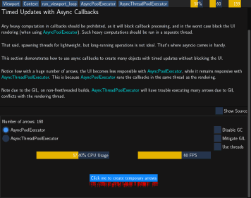

## DearCyGui: a Multi-platform (Windows, Linux, Mac) GUI library for Python

DearCyGui is an easy to use library to make graphical interfaces in Python.

Main features are:
* *Fast*. Speed to create and manage the interface has been one of the main focus.
* *Dynamic interface*. It is based on Dear ImGui (https://github.com/ocornut/imgui) to render. Each frame is new, and there is no cost if the content changes a lot a frame to another.
* Unlike other libraries based on Dear ImGui that provide access to its low-level API, DearCyGui is more *high level*. As a result your code is easier to read, and less prone to errors. Python is not adapted to call the low-level API as it would quickly become slow (as you would be required to re-render every frame). In DearCyGui you build objects and the backend handles calling the low-level API.
* *Customization*. You can create your own widgets or draw elements, and alter how they are rendered.
* *Even more customization*, if using Cython. You can `cimport` DearCyGui and directly access the item internals or create your own drawing functions.
* Adapted for *Object Oriented Programming* (All items can be subclassed), though you can use other styles as well.
* Uses *SDL3*, and thus has high quality and up-to-date support for DPI handling, etc.
* MIT Licensed.
* Low GPU/CPU usage.



## Installing
`pip install dearcygui` to install an old version

Latest development version:
```
git clone --recurse-submodules https://github.com/DearCyGui/DearCyGui
cd DearCyGui
pip install .
```

## Examples & Documentation

* Demos Gallery: [https://github.com/DearCyGui/Demos]
* Documentation: See the `docs` directory or run `documentation.py` in the demos


## Design Philosophy
DearCyGui bridges the gap between Python's ease of use and Dear ImGui's performance. Rather than making direct Dear ImGui calls each frame from Python (which would be slow), DearCyGui:

* Uses objects created in Python but managed by compiled C++ code (generated with Cython)
* C++ code handles the per-frame rendering via Dear ImGui
* Python code defines the UI structure and handles application logic
* Cython enables seamless integration between Python and C++

This architecture provides:
* Fast rendering performance
* Clean, Pythonic API
* Full Dear ImGui functionality
* Extensibility through subclassing

## Credits
DearCyGui began as a Cython reimplementation of DearPyGui (https://github.com/hoffstadt/DearPyGui) but has evolved with additional features and a different architecture.

This project uses:
* Dear ImGui (https://github.com/ocornut/imgui), and ImPlot, ImNodes.
* SDL3
* FreeType
* Cython

Huge thanks to the Cython team which have enabled this project to see the light of the day.

Portions of this software are copyright © 2024 The FreeType
Project (www.freetype.org).  All rights reserved.
